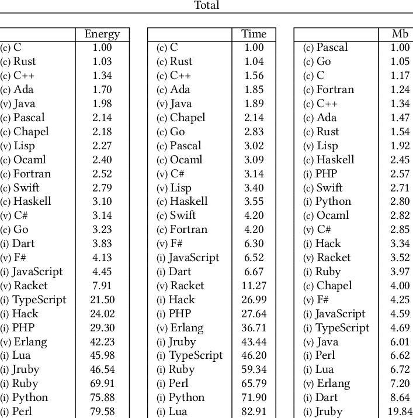

# learn-rust

COMPILER - `rustc`
COMPILATION - `rustc hello.rs`
EXECUTION OF THE GENERATED EXCUATABLE BINARY - `./hello`

## Why learning Rust?

1. Fastest language after C
2. Rich type system
3. No garbage collector (faster runtime)
4. Useful compiler output
5. Memory safety
6. Most beloved programming language since 2016 (Stack Overflow)
7. Fast adoption in various branches

